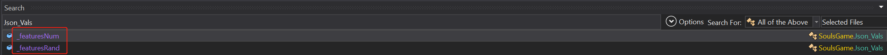
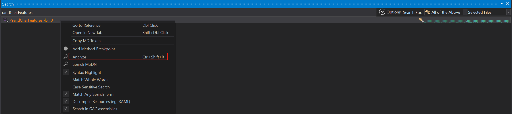
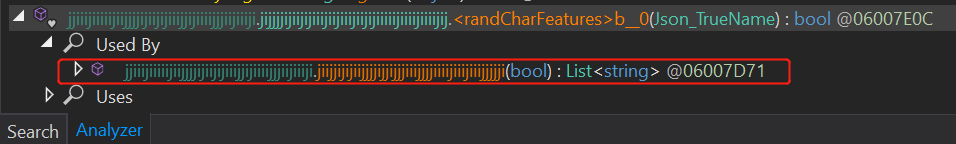
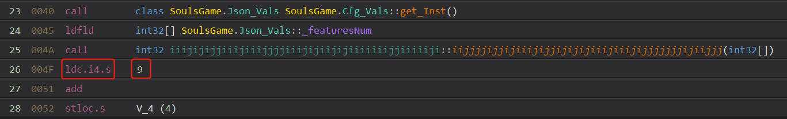
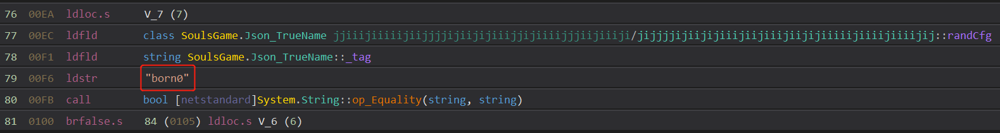

# 漂流佣兵

这是二次元穿越者的异世界幻想，可以悠闲又有策略深度的进行冒险，可以构筑套牌，可以爽快弹珠，还能不伤钱包的抽抽抽收集美少女，组建只属于自己的后宫......咳咳，佣兵团。 美少女收集+卡牌+弹珠的极致综合体验！！！


# `Assembly-CSharp.dll` 修改教程

## 最新支持版本：**v0.8.230309p3**

文件地址：**Steam安装路径\Steam\steamapps\common\WanderHero_EA\WanderHero\WanderHero_Data\Managed**

## 目录

* [神眷9选9的修改](https://github.com/wrj2wmy/unity-game-mods/wander-hero#神眷9选9的修改)

## 神眷9选9的修改

### 第一步:修改数量和神眷出现的权重

**【搜索内容】**


**【修改的类】** Jason_Vars

**【原版代码】** 
```csharp
````

**【修改内容】** 
```csharp
public int[] _featuresNum = new int[]
{
	0,  # 出现一个天赋的权重
	0,  # 出现两个天赋的权重
	100 # 出现三个天赋的权重
};

public int[] _featuresRand = new int[]
{
	0,  # 出现负面属性的权重
	0,  # 出现常见属性的权重
	0,  # 出现稀有属性的权重
	0,  # 出现奇迹属性的权重
	100 # 出现神眷属性的权重
};
````

### 第二步:修改9选9的选择逻辑

**【搜索内容】**


搜索`randCharFeatures`, 并右键单击唯一结果，选择分析(Analyze), 展开`被使用 (Used By)`:



双击唯一结果

**【原版代码】** 
```csharp
{
	int num = Cfg_Vals.Inst._featuresNum.iijjjjijjijiiijijjijijijiiijiiijijjjjjjjijiijjj() + 1;
	bool flag = false;
	for (int i = 0; i < num; i++)
	{
		int num2 = Cfg_Vals.Inst._featuresRand.iijjjjijjijiiijijjijijijiiijiiijijjjjjjjijiijjj();
		if (flag)
		{
			num2 = num2.iiijjjjijjjijijjijiijijjjijjjjjjjjjjjijjijjijji(3);
		}
		string ijjjijjjjjijjijjjiijijiijijjijjiiiijiijjjiiiiji2 = string.Format("born{0}", num2);
		List<Json_TrueName> ijijjjjjjiijiiiijjijijijijiiiiiijjiiiijjjjiijij = Cfg_TrueName.Inst.ijijjjijiijjiiiiijijjjjjjjiiiiijjjjjiiijijjjjji(ijjjijjjjjijjijjjiijijiijijjijjiiiijiijjjiiiiji2, false);
		Json_TrueName randCfg = ijijjjjjjiijiiiijjijijijijiiiiiijjiiiijjjjiijij.ijjjiijijjjiijiijiiijijjijjjjjijijiijjiiiiijijj(1);
		if (list2.Find((Json_TrueName val) => val._id.Substring(0, val._id.Length - 1) == randCfg._id.Substring(0, randCfg._id.Length - 1)) == null)
		{
			list2.Add(randCfg);
			list.Add(randCfg._id);
			if (randCfg._tag == "born4")
			{
				flag = true;
			}
		}
	}
}
````

**【修改内容】** 
```csharp
{
	int num = Cfg_Vals.Inst._featuresNum.iijjjjijjijiiijijjijijijiiijiiijijjjjjjjijiijjj() + 9; #数量改成9
	bool flag = false;
	for (int i = 0; i < num; i++)
	{
		int num2 = Cfg_Vals.Inst._featuresRand.iijjjjijjijiiijijjijijijiiijiiijijjjjjjjijiijjj();
		if (flag)
		{
			num2 = num2.iiijjjjijjjijijjijiijijjjijjjjjjjjjjjijjijjijji(3);
		}
		string ijjjijjjjjijjijjjiijijiijijjijjiiiijiijjjiiiiji2 = string.Format("born{0}", num2);
		List<Json_TrueName> ijijjjjjjiijiiiijjijijijijiiiiiijjiiiijjjjiijij = Cfg_TrueName.Inst.ijijjjijiijjiiiiijijjjjjjjiiiiijjjjjiiijijjjjji(ijjjijjjjjijjijjjiijijiijijjijjiiiijiijjjiiiiji2, false);
		Json_TrueName randCfg = ijijjjjjjiijiiiijjijijijijiiiiiijjiiiijjjjiijij.ijjjiijijjjiijiijiiijijjijjjjjijijiijjiiiiijijj(1);
		if (list2.Find((Json_TrueName val) => val._id.Substring(0, val._id.Length - 1) == randCfg._id.Substring(0, randCfg._id.Length - 1)) == null)
		{
			list2.Add(randCfg);
			list.Add(randCfg._id);
			if (randCfg._tag == "born0") # 将`born4`改成`born0`
			{
				flag = true;
			}
		}
	}
}
````
注意次处需要用IL指令来修改

修改数字9:


修改字符born4:
