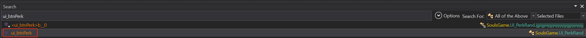
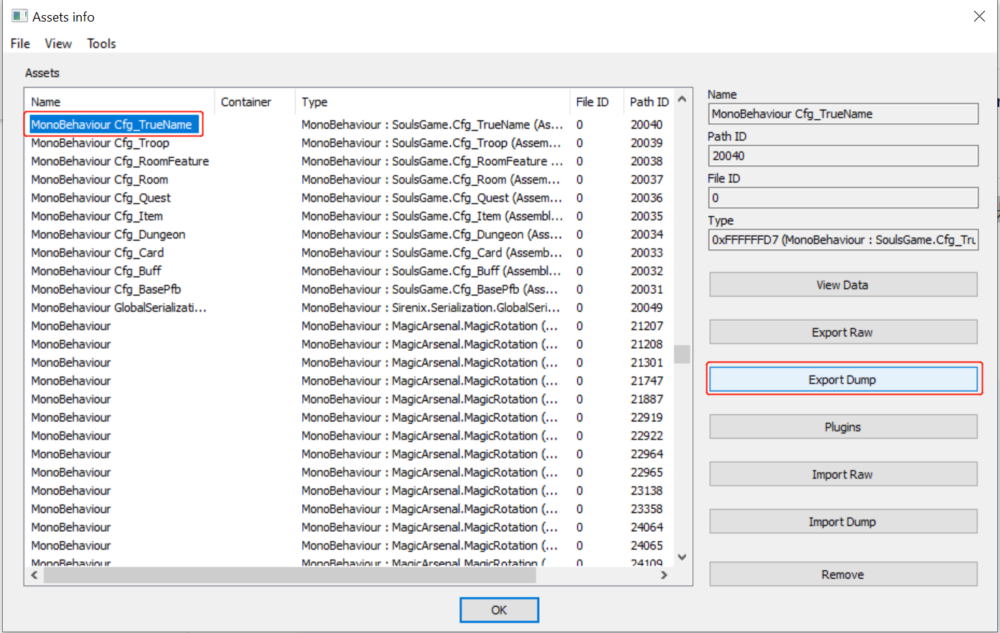
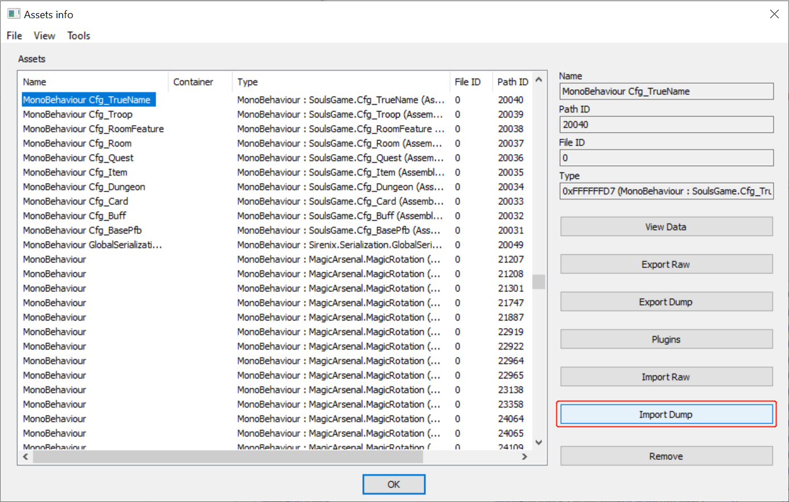

# 漂流佣兵

这是二次元穿越者的异世界幻想，可以悠闲又有策略深度的进行冒险，可以构筑套牌，可以爽快弹珠，还能不伤钱包的抽抽抽收集美少女，组建只属于自己的后宫......咳咳，佣兵团。 美少女收集+卡牌+弹珠的极致综合体验！！！

## 最新支持版本：**v0.8.230309p3**

## 目录

* [神眷9选9的修改](https://github.com/wrj2wmy/unity-game-mods/tree/main/wander-hero#神眷9选9的修改)
* [附魔概率的修改](https://github.com/wrj2wmy/unity-game-mods/tree/main/wander-hero#附魔概率的修改)
* [副本事件的修改](https://github.com/wrj2wmy/unity-game-mods/tree/main/wander-hero#副本事件的修改)

# `Assembly-CSharp.dll` 修改教程

文件地址：**Steam安装路径\Steam\steamapps\common\WanderHero_EA\WanderHero\WanderHero_Data\Managed**

## 神眷9选9的修改

### 第一步:修改数量和神眷出现的权重

**【搜索内容】**


**【修改的类】** Jason_Vars

**【原版代码】** 
```csharp
````

**【修改内容】** 
```csharp
public int[] _featuresNum = new int[]
{
	0,  //出现一个天赋的权重
	0,  //出现两个天赋的权重
	100 //出现三个天赋的权重
};

public int[] _featuresRand = new int[]
{
	0,  //出现负面属性的权重
	0,  //出现常见属性的权重
	0,  //出现稀有属性的权重
	0,  //出现奇迹属性的权重
	100 //出现神眷属性的权重
};
````

### 第二步:修改9选9的选择逻辑

**【搜索内容】**


搜索`randCharFeatures`, 并右键单击唯一结果，选择分析(Analyze), 展开`被使用 (Used By)`:


双击唯一结果

**【原版代码】** 
```csharp
{
	int num = Cfg_Vals.Inst._featuresNum.iijjjjijjijiiijijjijijijiiijiiijijjjjjjjijiijjj() + 1;
	bool flag = false;
	for (int i = 0; i < num; i++)
	{
		int num2 = Cfg_Vals.Inst._featuresRand.iijjjjijjijiiijijjijijijiiijiiijijjjjjjjijiijjj();
		if (flag)
		{
			num2 = num2.iiijjjjijjjijijjijiijijjjijjjjjjjjjjjijjijjijji(3);
		}
		string ijjjijjjjjijjijjjiijijiijijjijjiiiijiijjjiiiiji2 = string.Format("born{0}", num2);
		List<Json_TrueName> ijijjjjjjiijiiiijjijijijijiiiiiijjiiiijjjjiijij = Cfg_TrueName.Inst.ijijjjijiijjiiiiijijjjjjjjiiiiijjjjjiiijijjjjji(ijjjijjjjjijjijjjiijijiijijjijjiiiijiijjjiiiiji2, false);
		Json_TrueName randCfg = ijijjjjjjiijiiiijjijijijijiiiiiijjiiiijjjjiijij.ijjjiijijjjiijiijiiijijjijjjjjijijiijjiiiiijijj(1);
		if (list2.Find((Json_TrueName val) => val._id.Substring(0, val._id.Length - 1) == randCfg._id.Substring(0, randCfg._id.Length - 1)) == null)
		{
			list2.Add(randCfg);
			list.Add(randCfg._id);
			if (randCfg._tag == "born4")
			{
				flag = true;
			}
		}
	}
}
````

**【修改内容】** 
```csharp
{
	int num = Cfg_Vals.Inst._featuresNum.iijjjjijjijiiijijjijijijiiijiiijijjjjjjjijiijjj() + 9; //数量改成9
	bool flag = false;
	for (int i = 0; i < num; i++)
	{
		int num2 = Cfg_Vals.Inst._featuresRand.iijjjjijjijiiijijjijijijiiijiiijijjjjjjjijiijjj();
		if (flag)
		{
			num2 = num2.iiijjjjijjjijijjijiijijjjijjjjjjjjjjjijjijjijji(3);
		}
		string ijjjijjjjjijjijjjiijijiijijjijjiiiijiijjjiiiiji2 = string.Format("born{0}", num2);
		List<Json_TrueName> ijijjjjjjiijiiiijjijijijijiiiiiijjiiiijjjjiijij = Cfg_TrueName.Inst.ijijjjijiijjiiiiijijjjjjjjiiiiijjjjjiiijijjjjji(ijjjijjjjjijjijjjiijijiijijjijjiiiijiijjjiiiiji2, false);
		Json_TrueName randCfg = ijijjjjjjiijiiiijjijijijijiiiiiijjiiiijjjjiijij.ijjjiijijjjiijiijiiijijjijjjjjijijiijjiiiiijijj(1);
		if (list2.Find((Json_TrueName val) => val._id.Substring(0, val._id.Length - 1) == randCfg._id.Substring(0, randCfg._id.Length - 1)) == null)
		{
			list2.Add(randCfg);
			list.Add(randCfg._id);
			if (randCfg._tag == "born0") //将`born4`改成`born0`
			{
				flag = true;
			}
		}
	}
}
````
注意此处需要用IL指令来修改

修改数字9:


修改字符born4:


### 第三步:去除只能选三个神眷的UI限制

**【搜索内容】**



**【原版代码】** 
```csharp
public void ui_btnPerk(RectTransform ijjjjiijijiiiijjijjjjijjjiiijijjjjijiijiijjjjjj)
{
	int item = this._perkList.iiijiiiijijiijiijjjiijiijjiiiiijjijjijijjiiiiji((RectTransform val) => val == ijjjjiijijiiiijjijjjjijjjiiijijjjjijiijiijjjjjj).Item2;
	GameObject gameObject = this.ijjiijiijjjjijjjjijjjjijjjjjiijjiijiiijijjjjijj[item];
	if (gameObject.activeSelf)
	{
		gameObject.jjijiijijijjiiiiiiijiiiiiijijjjjiijjiiiijjiijji(false);
		return;
	}
	if (this.jjjjiijiijiiijijjiiijjiijjijiijiijijiijjijijjii() >= 3)
	{
		"showTip_perkPickMax".ijjijjijjjijjiijjijjjjiijjjiijjijjiiijijijjjiii().iijiijiiijiijjjjjjijjijjjjiijijjijjjjjiiijiijji(default(Color), true);
		return;
	}
	gameObject.jjijiijijijjiiiiiiijiiiiiijijjjjiijjiiiijjiijji(true);
}
````

**【修改内容】** 
```csharp
public void ui_btnPerk(RectTransform ijjjjiijijiiiijjijjjjijjjiiijijjjjijiijiijjjjjj)
{
	int item = this._perkList.iiijiiiijijiijiijjjiijiijjiiiiijjijjijijjiiiiji((RectTransform val) => val == ijjjjiijijiiiijjijjjjijjjiiijijjjjijiijiijjjjjj).Item2;
	GameObject gameObject = this.ijjiijiijjjjijjjjijjjjijjjjjiijjiijiiijijjjjijj[item];
	if (gameObject.activeSelf)
	{
		gameObject.jjijiijijijjiiiiiiijiiiiiijijjjjiijjiiiijjiijji(false);
		return;
	}
	if (this.jjjjiijiijiiijijjiiijjiijjijiijiijijiijjijijjii() >= 9) //把此处3改成9
	{
		"showTip_perkPickMax".ijjijjijjjijjiijjijjjjiijjjiijjijjiiijijijjjiii().iijiijiiijiijjjjjjijjijjjjiijijjijjjjjiiijiijji(default(Color), true);
		return;
	}
	gameObject.jjijiijijijjiiiiiiijiiiiiijijjjjiijjiiiijjiijji(true);
}
````

注意此处需要用IL指令来修改

修改数字9:


# `resources.assets` 修改教程

文件地址：**Steam安装路径\Steam\steamapps\common\WanderHero_EA\WanderHero\WanderHero_Data**

## 附魔概率的修改

需要用到UABE(Unity Assemble Bundle Extractor)来提取游戏的配置文件
我们需要提取的文件是`cfg_TrueName`, 找到后点击导出 `Export Dump`



修改完成后选择导入`Import Dump`


导入成功后，软件会弹出保存界面，将保存后的`resources.assets`文件替换原本的文件就完成了修改。

### 属性修改

打开导出的txt或json文件, 以金色附魔扩散的修改为例, 具体的ID可以参考最后的ID对照表：

**【原版代码】** 
```text
   [127]
    0 Json_TrueName data
     1 string _id = "enchant_flySpread3"
     1 string _name = ""
     1 string _desc = ""
     1 string _tag = "enchant3"
     0 int _weight = 3
     1 string _exData = ""
     1 string _color = "gold"
     0 float _addTradeVal = 5
     0 vector _objMod
      0 Array Array (1 items)
       0 int size = 1
       [0]
        1 string data = "flySpread +6, castAngle +90"
     0 Json_XObjSkill _attachSkills
      0 Array Array (0 items)
       0 int size = 0
     0 Json_CardSkill _attachCardSkills
      0 Array Array (0 items)
       0 int size = 0
````

**【修改内容】** 
```text
   [127]
    0 Json_TrueName data
     1 string _id = "enchant_flySpread3"
     1 string _name = ""
     1 string _desc = ""
     1 string _tag = "enchant3"
     0 int _weight = 2000
     1 string _exData = ""
     1 string _color = "gold"
     0 float _addTradeVal = 5
     0 vector _objMod
      0 Array Array (1 items)
       0 int size = 1
       [0]
        1 string data = "flySpread +6, castAngle +90"
     0 Json_XObjSkill _attachSkills
      0 Array Array (0 items)
       0 int size = 0
     0 Json_CardSkill _attachCardSkills
      0 Array Array (0 items)
       0 int size = 0
````

将 `0 int _weight = 3` 改成 `0 int _weight = 2000`, 极大的增加了附魔随机出现的权重

`1 string data = "flySpread +6, castAngle +90"` 这一行是附魔的具体效果，你也可以增加此处的数值来增效其效果

## 副本事件的修改
To be added...


## 真名ID对照表

### 附魔效果

| 真名                         | 名称 | 最大等级 | 效果                                           | 满级效果                     |
| -------------------------- | -- | ---- | -------------------------------------------- | ------------------------ |
| enchant_flySpread1         | 分裂 | 1    | 扩散 +2 , 角度 +30                               | 扩散 +2 , 角度 +30           |
| enchant_flySpread2         | 扩散 | 1    | 扩散 +4 , 角度 +60                               | 扩散 +4 , 角度 +60           |
| enchant_flySpread3         | 弹幕 | 1    | 扩散 +6 , 角度 +90                               | 扩散 +6 , 角度 +90           |
| enchant_parry1             | 防护 | 12   | 格挡 +1                                        | 格挡 +16                   |
| enchant_parry2             | 坚守 | 12   | 格挡 +2                                        | 格挡 +32                   |
| enchant_parry3             | 铁壁 | 12   | 格挡 +3                                        | 格挡 +48                   |
| enchant_aimError1          | 鹰眼 | 1    | 精准 +3                                        | 精准 +3                    |
| enchant_aimError2          | 神射 | 1    | 精准 +6                                        | 精准 +6                    |
| enchant_aimError3          | 锁定 | 1    | 精准 +9                                        | 精准 +9                    |
| enchant_thornsM1           | 火盾 | 12   | 反震 +1                                        | 反震 +16                   |
| enchant_thornsM2           | 反弹 | 12   | 反震 +2                                        | 反震 +32                   |
| enchant_thornsM3           | 结界 | 12   | 反震 +3                                        | 反震 +48                   |
| enchant_zoc1               | 游走 | 1    | 机动 +80                                       | 机动 +80                   |
| enchant_zoc2               | 协同 | 1    | 机动 +120                                      | 机动 +120                  |
| enchant_zoc3               | 战术 | 1    | 机动 +160                                      | 机动 +160                  |
| enchant_atkM1              | 淬魔 | 12   | 魔法 +1                                        | 魔法 +16                   |
| enchant_atkM2              | 导魔 | 12   | 魔法 +2                                        | 魔法 +32                   |
| enchant_atkM3              | 魔化 | 12   | 魔法 +3                                        | 魔法 +48                   |
| enchant_atk1               | 强壮 | 12   | 攻击 +1                                        | 攻击 +16                   |
| enchant_atk2               | 蛮力 | 12   | 攻击 +2                                        | 攻击 +32                   |
| enchant_atk3               | 怪力 | 12   | 攻击 +3                                        | 攻击 +48                   |
| enchant_hp1                | 健康 | 12   | 生命 +4                                        | 生命 +64                   |
| enchant_hp2                | 活力 | 12   | 生命 +8                                        | 生命 +128                  |
| enchant_hp3                | 生命 | 12   | 生命 +12                                       | 生命 +192                  |
| enchant_atkTimes1          | 连射 | 1    | 射击 +1                                        | 射击 +1                    |
| enchant_atkTimes2          | 多重 | 1    | 射击 +2                                        | 射击 +2                    |
| enchant_atkTimes3          | 弹链 | 1    | 射击 +3                                        | 射击 +3                    |
| enchant_atkMin1            | 碎裂 | 12   | 必伤 +1                                        | 必伤 +16                   |
| enchant_atkMin2            | 神能 | 12   | 必伤 +2                                        | 必伤 +32                   |
| enchant_atkMin3            | 毁灭 | 12   | 必伤 +3                                        | 必伤 +48                   |
| enchant_thorns1            | 荆棘 | 12   | 反击 +1                                        | 反击 +16                   |
| enchant_thorns2            | 倒刺 | 12   | 反击 +2                                        | 反击 +32                   |
| enchant_thorns3            | 反转 | 12   | 反击 +3                                        | 反击 +48                   |
| enchant_buffLv1            | 增幅 | 12   | 施法 +1                                        | 施法 +16                   |
| enchant_buffLv2            | 强效 | 12   | 施法 +2                                        | 施法 +32                   |
| enchant_buffLv3            | 极效 | 12   | 施法 +3                                        | 施法 +48                   |
| enchant_hitRadius1         | 飞溅 | 1    | 范围 +80                                       | 范围 +80                   |
| enchant_hitRadius2         | 波动 | 1    | 范围 +120                                      | 范围 +120                  |
| enchant_hitRadius3         | 冲击 | 1    | 范围 +160                                      | 范围 +160                  |
| enchant_pierce1            | 聚能 | 1    | 穿透 +1                                        | 穿透 +1                    |
| enchant_pierce2            | 刺穿 | 1    | 穿透 +2                                        | 穿透 +2                    |
| enchant_pierce3            | 贯穿 | 1    | 穿透 +3                                        | 穿透 +3                    |
| enchant_buffResist1        | 抵抗 | 1    | 免疫 +10%                                      | 免疫 +10%                  |
| enchant_buffResist2        | 驱散 | 1    | 免疫 +20%                                      | 免疫 +20%                  |
| enchant_buffResist3        | 净化 | 1    | 免疫 +30%                                      | 免疫 +30%                  |
| enchant_dodge1             | 闪躲 | 1    | 闪避 +10%                                      | 闪避 +10%                  |
| enchant_dodge2             | 模糊 | 1    | 闪避 +15%                                      | 闪避 +15%                  |
| enchant_dodge3             | 幻影 | 1    | 闪避 +20%                                      | 闪避 +20%                  |
| enchant_prec1              | 专注 | 1    | 命中 +10%                                      | 命中 +10%                  |
| enchant_prec2              | 精确 | 1    | 命中 +20%                                      | 命中 +20%                  |
| enchant_prec3              | 必中 | 1    | 命中 +30%                                      | 命中 +30%                  |
| enchant_armorPierce1       | 尖锐 | 1    | 穿甲 +10%                                      | 穿甲 +10%                  |
| enchant_armorPierce2       | 击穿 | 1    | 穿甲 +20%                                      | 穿甲 +20%                  |
| enchant_armorPierce3       | 透甲 | 1    | 穿甲 +30%                                      | 穿甲 +30%                  |
| enchant_resistM1           | 耐魔 | 1    | 魔抗 +10%                                      | 魔抗 +10%                  |
| enchant_resistM2           | 魔抗 | 1    | 魔抗 +20%                                      | 魔抗 +20%                  |
| enchant_resistM3           | 破魔 | 1    | 魔抗 +30%                                      | 魔抗 +30%                  |
| enchant_resist1            | 忍耐 | 1    | 物抗 +10%                                      | 物抗 +10%                  |
| enchant_resist2            | 韧性 | 1    | 物抗 +20%                                      | 物抗 +20%                  |
| enchant_resist3            | 不屈 | 1    | 物抗 +30%                                      | 物抗 +30%                  |
| enchant_speed1             | 轻快 | 1    | 移速 +10%                                      | 移速 +10%                  |
| enchant_speed2             | 疾风 | 1    | 移速 +20%                                      | 移速 +20%                  |
| enchant_speed3             | 神速 | 1    | 移速 +30%                                      | 移速 +30%                  |
| enchant_buffPierce1        | 精巧 | 1    | 术式 +10%                                      | 术式 +10%                  |
| enchant_buffPierce2        | 叠加 | 1    | 术式 +20%                                      | 术式 +20%                  |
| enchant_buffPierce3        | 三重 | 1    | 术式 +30%                                      | 术式 +30%                  |
| enchant_fatalPower1        | 技巧 | 1    | 暴击 +30%                                      | 暴击 +30%                  |
| enchant_fatalPower2        | 看穿 | 1    | 暴击 +60%                                      | 暴击 +60%                  |
| enchant_fatalPower3        | 心眼 | 1    | 暴击 +90%                                      | 暴击 +90%                  |
| enchant_atkX1              | 强攻 | 1    | 强化 +10%                                      | 强化 +10%                  |
| enchant_atkX2              | 斗志 | 1    | 强化 +20%                                      | 强化 +20%                  |
| enchant_atkX3              | 热血 | 1    | 强化 +30%                                      | 强化 +30%                  |
| enchant_drainHp1           | 吸血 | 12   | 吸血 +1                                        | 吸血 +16                   |
| enchant_stopArcaneBeam     | 高能 | 5    | 向队友停下的位置发射光束【必伤2】                            | 【必伤32】                   |
| enchant_cardCoopGernade    | 轰炸 | 5    | 在场时 , 向攻击牌击中的敌人抛射炸弹【必伤2】                     | 【必伤32】                   |
| enchant_cardCoopIceLance   | 冰锥 | 5    | 在场时 , 向攻击牌击中的敌人发射冰锥【必伤2】                     | 【必伤32】                   |
| enchant_cardCoopLightning  | 闪电 | 5    | 在场时 , 向攻击牌击中的敌人发射闪电【必伤2】                     | 【必伤32】                   |
| enchant_cardCoopFloatBlade | 飞刃 | 5    | 在场时 , 每当打出防御牌，召唤3个浮游刀刃【必伤2】                  | 【必伤32】                   |
| enchant_moveSlashCircle    | 旋风 | 5    | 移动时 , 在周围产生风刃切割【必伤2】                         | 【必伤32】                   |
| enchant_moveManaArrowRand  | 乱流 | 5    | 移动时 , 随机向周围喷射魔弹【必伤2】                         | 【必伤32】                   |
| enchant_cardCoopSpdUp      | 疾走 | 1    | 在场时 , 每当打出buff或辅助牌 , 移速 +15% , 射击 +1 , 精准 +1 |                          |
| enchant_cardCoopHeal       | 治愈 | 5    | 在场时 , 每当打出buff或辅助牌 , 治疗3生命                   |  治疗48生命                  |
| enchant_cardCoopHolyShield | 圣盾 | 1    | 在场时 , 每当打出buff或辅助牌 , 获得 一层圣盾                 |                          |
| enchant_cardCoopFireChains | 火链 | 1    | 在场时 , 每当打出防御牌 , 与最近的友军间产生伤害敌人的火焰锁链【必伤2】      | 【必伤32】                   |
| enchant_hitLightning       | 导电 | 5    | 角色击中敌人时产生闪电【必伤2】                             | 【必伤32】                   |
| enchant_hitFlame           | 爆炎 | 5    | 角色击中敌人时产生爆炸【必伤2】                             | 【必伤32】                   |
| enchant_splitMana          | 散弹 | 5    | 角色击中敌人时产生散弹【必伤2】                             | 【必伤32】                   |
| enchant_stopFireArea       |    | 5    | 当移动停止时，在脚下产生火焰区域【必伤2】                        | 【必伤32】                   |
| enchant_stopAcidClound     | 酸雾 | 5    | 停下时，向周围释放大量酸雾【必伤2】                           | 【必伤32】                   |
| enchant_rockBody           | 刚体 | 1    | 弹飞击中自己的近战敌人，攻击力240【必伤1】                      |                          |
| enchant_cardCoopHoldPos    |    | 5    | 在场时 , 每当打出防御牌 , 反击 +2 , 护甲 +1 , 速度-15%       | 反击 +32 , 护甲 +16 , 速度-15% |
| enchant_cardCoopManaCost-  |    | 1    | 随即一张手牌消耗行动力减一                                |                          |
| enchant_cardCoopMana+      |    | 1    | 增加一点行动力                                      |                          |
| enchant_cardCoopDrawCard   |    | 1    | 抽牌+1                                         |                          |

### 普通天赋
| 真名                   | 名称      | 效果                             |
| -------------------- | ------- | ------------------------------ |
| bornDodge1           | 敏捷      | 闪避+2.5%                        |
| bornAtk1             | 肌肉结实    | 攻击+1                           |
| bornAtkM1            | 魔力充盈    | 魔法+1                           |
| bornFatalPower1      | 看破      | 暴击+15%                         |
| bornSpeed1           | 迅速      | 移速+5%                          |
| bornAtkX1            | 积极进攻    | 总伤害+5%                         |
| bornResistCrush1     | 力量控制    | 物理伤害+5%                        |
| bornResistCrushM1    | 魔力厚实    | 魔法伤害+5%                        |
| bornPrec1            | 精确打击    | 命中+5%                          |
| bornCardAtkX1        | 战技精通    | 攻击牌伤害+10%                      |
| bornaimError1        | 高明射手    | 射击精准+2                         |
| bornParry1           | 格挡精通    | 格挡+2                           |
| bornThorns1          | 直觉还击    | 反击+1                           |
| bornThornsM1         | 元素护体    | 反震+1                           |
| bornResist1          | 体格坚韧    | 物理抗性+5%                        |
| bornResistM1         | 魔力护盾    | 魔法抗性+5%                        |
| bornZoc1             | 外向      | 机动范围+40                        |
| bornHp1              | 健康      | 生命值+5                          |

### 稀有天赋
| 真名                   | 名称      | 效果                             |
| -------------------- | ------- | ------------------------------ |
| bornDodge2           | 灵活      | 闪避+5%                          |
| bornAtk2             | 天生神力    | 攻击+2                           |
| bornAtkM2            | 强大魔力    | 魔法+2                           |
| bornFatalPower2      | 心眼      | 暴击+30%                         |
| bornSpeed2           | 高速      | 移速+10%                         |
| bornAtkX2            | 斗志      | 总伤害+10%                        |
| bornResistCrush2     | 力量聚焦    | 物理伤害+10%                       |
| bornResistCrushM2    | 魔力致密    | 魔法伤害+10%                       |
| bornPrec2            | 精准预判    | 命中+10%                         |
| bornCardAtkX2        | 战技大师    | 攻击牌伤害+20%                      |
| bornAimError2        | 狙击手     | 射击精准+4                         |
| bornArmor1           | 硬化皮肤    | 护甲+1                           |
| bornAtkMin1          | 杀意      | 必伤+1                           |
| bornCardDef2         | 防御大师    | 防御牌提供的格挡+2，护甲+1                |
| bornParry2           | 格挡大师    | 格挡+3                           |
| bornThorns 2         | 倒刺护甲    | 反击+2                           |
| bornThornsM2         | 元素屏障    | 反震+2                           |
| bornResist2          | 怪物体格    | 物理抗性+10%                       |
| bornResistM2         | 魔力护体    | 魔法抗性+10%                       |
| bornZoc2             | 领袖气质    | 机动范围+80                        |
| bornHp2              | 强壮      | 生命值+10                         |

### 奇迹天赋
| 真名                   | 名称      | 效果                             |
| -------------------- | ------- | ------------------------------ |
| bornDrainHp1         | 吸血鬼     | 吸血+1                           |
| bornAtkTimes1        | 快速装填    | 射击+1                           |
| bornPierce1          | 强力贯穿    | 穿透+1                           |
| bornDodge3           | 朦胧幻影    | 闪避+10%                         |
| bornAtk3             | 怪力体术    | 攻击+3                           |
| bornAtkM3            | 魔王之血    | 魔法+3                           |
| bornFatalPower3      | 明镜止水    | 暴击+45%                         |
| bornSpeed3           | 闪光      | 移速+20%                         |
| bornAtkX3            | 狂战士     | 总伤害+20%                        |
| bornResistCrush3     | 螺旋力     | 物理伤害+20%                       |
| bornResistCrushM3    | 魔力压缩    | 魔法伤害+20%                       |
| bornPrec3            | 未来视觉    | 命中+20%                         |
| bornCardAtkX3        | 战技之王    | 攻击牌伤害+30%                      |
| bornAinError3        | 神射手     | 射击精准+6                         |
| borror2              | 砂石铠甲    | 护甲+2                           |
| bornAtkMin2          | 杀戮机器    | 必伤+2                           |
| bornCardDef3         | 防御之王    | 防御牌提供的格挡+3，护甲+1                |
| borParry3            | 格挡之王    | 格挡+4                           |
| bornThorns3          | 以牙还牙    | 反击+3                           |
| bornThornsM3         | 元素结界    | 反震+3                           |
| bornResist3          | 钢铁躯体    | 物理抗性+20%                       |
| bornResistM3         | 魔力铠甲    | 魔法抗性+20%                       |
| bornZoc3             | 王者之气    | 机动范围+120                       |
| bornHp3              | 兽化体格    | 生命值+20                         |

### 神眷天赋
| 真名                   | 名称      | 效果                             |
| -------------------- | ------- | ------------------------------ |
| bornMonsterHunter    | 怪物猎人    | 击杀精英和boss 可额外获得强化素材            |
| bornSeeFuture        | 全知之眼    | 自动获得怪物,地牢情报,战斗中可查看剩余牌堆顺序       |
| bornRuneMaster       | 魔法纹贤者   | 装备附魔消耗50%,移除所有附魔装备缺陷           |
| bornWildSurvivor     | 荒野生存大师  | 世界移动不受地形影响,脱离补给可坚持十天           |
| bornBlessOfEris      | 幸运女神的祝福 | 第一回合,己方全体闪避+300%               |
| bornLoverLvUp        | 补魔      | 营火处可随机提升一个同伴等级,主角-20%生命        |
| bornEscapees         | 逃跑大师    | 世界地图遭遇战撤退必成功,战斗第一回合就可脱离        |
| bornSlaveBossGirl    | 魔物净化    | Boss 战结束时,随机获得一个同伴             |
| bornAllWeaponMaster  | 使魔武器大师  | 可使用任何装备                        |
| bornPaladinofGodLove | 神宠的圣骑士  | 每回合开始获得2层圣盾                    |
| bornOrcFace          | 兽人脸直男   | 行动力额外+2                        |
| bornBookFavor        | 从小痴迷看书  | 领悟战斗技能时选择+2                    |
| bornHitFlyCharge     | 狂风斩击    | 向落地的敌人冲刺并多段攻击                  |
| bornHarenWings       | 都是我的翅膀  | 卡组每多一个同伴,主角移速+15%              |
| bornHarenPower       | 同伴的期待   | 卡组每有一个同伴,主角伤害+6%               |
| bornReAction         | 精力恢复    | 行动结束时,获得再次行动,每回合一次             |
| bornKizunaPower      | 共鸣的羁绊   | 回合开始,手牌每有一张同伴,主角攻击+1,魔法+1,必伤+1 |
| bornStrongHeart      | 強者之路    | 击中敌人时,增加目标当前攻击力的伤害             |
| bornBerserkerCharge  | 狂暴冲锋    | 主角弹射或行动中免疫,双抗+1000%            |
| bornBecameBeast      | 不做人了    | 攻击+2,魔法+1,生命+20,吸血+1           |
| bornDrainHp2         | 古代吸血鬼   | 吸血+2                           |
| bornAtkTimes 2       | 自动装填    | 射击+2                           |
| bornPierce2          | 弱点贯穿    | 穿透+2                           |
| bornDodge4           | 灵体化     | 闪避+15%                         |
| bornBladeAndMagic    | 魔武双全    | 攻击+3,魔法+3                      |
| bornAtk4             | 巨人之血    | 攻击+5                           |
| bornAtkM4            | 魔神化身    | 魔法+5                           |
| bornFatalPower4      | 没有头发    | 暴击+150%                        |
| bornSpeed4           | 风之祝福    | 移速+35%                         |
| bornAtkX4            | 英灵之魂    | 总伤害+35%                        |
| bornResistCrush4     | 气       | 物理伤害+35%                       |
| bornResistCrushM4    | 魔力结晶    | 魔法伤害+35%                       |
| bornPrec4            | 必中直觉    | 命中+35%                         |
| bornCardatkX4        | 战技之神    | 牌伤害+40%                        |
| bornAimError4        | 魔眼      | 射击精准+9                         |
| bornArmor3           | 守护力场    | 护甲+3                           |
| bornTauntFace        | 嘲讽脸     | 回合开始,嘲讽敌人,场上每5个敌人提供1护甲         |
| bornAtkMin3          | 生命收割者   | 必伤+3                           |
| bornCardDef4         | 防御之神    | 防御牌提供的格挡+4,护甲+1                |
| bornParry4           | 格挡之神    | 格挡+6                           |
| bornThorns4          | 复仇链接    | 反击+5                           |
| bornThornsM4         | 元素领域    | 反震+5                           |
| bornResist4          | 金属细胞    | 物理抗性+35%                       |
| bornResistM4         | 魔防结界    | 魔法抗性+35%                       |
| bornFloatShield      | 远古护盾    | 永久环绕浮游盾,阻挡敌人射击                 |
| bornBossKiller       | Boss杀手  | 主角和技能卡对Boss 伤害+100%            |
| bornWeakWords        | 嘴遁      | 回合开始,敌方目标5%几率陷入眩晕              |
| bornGiftSSR          | 穿越时空的羁绊 | 新游戏随机获得一个图鉴同伴                  |
| bornKizunaOfGirls    | 美少女的羁绊  | 开局酒馆限定多招募一个伙伴                  |
| bornSlaveHarem       | 奴隶后宫    | 开局自带两个奴隶同伴                     |
| bornMagicOfWashHead  | 棍之术士洗脑法 | 回合开始,手牌随机一名同伴耗能-3              |
| bornCoopLover        | 亲密伙伴    | 每回合第一个入场同伴额外停留1回合              |
| bornCardMaster       | 卡牌大师    | 复制每回合第一张打出的技能卡,能耗-2加入手牌        |
| bornKillingTime      | 处决时间    | 能耗2以下的攻击牌杀死敌人,复制到手牌且能耗-2,每回合3次 |
| bornOtakukeborn      | 死宅转生    | 回合开始时,随机一张技能卡耗能-3              |
| bornTreasureMap      | 宝藏地图    | 在营火处可选择随机打开一个宝箱                |
| bornGameLegacy       | 游戏遗产    | 开局额外10000金币,三件附魔装备             |
| bornPlayerTurnTime   | 主场时间    | 玩家结束回合前,己方全体双抗+35%             |
| bornSlashStream      | 黑衣剑士成名技 | 近战击中敌人时,追加一记斩击                 |
| bornSkeletonKnight   | 骨头骑士    | 近战击中敌人时向周围斩击                   |
| bornZakuh            | 村民A     | 每回合生成3枚浮游魔弹                    |
| bornBraveCareful     | 勇者级慎重   | 击杀敌人时,追加释放地狱火                  |
| bornLoveOfWitch      | 嫉妒魔女的宠溺 | 受攻击时,向攻击者发射暗影                  |
| bornEndFireball      | 爆裂吧!    | 回合结束时,向最近的敌人射出火球               |
| bornHitFireArea      | 火焰战士    | 每回合前3次击中敌人,产生火焰区域              |
| bornOtakuMarine      | 死宅特种兵射术 | 向进入范围的敌人火力压制,每回合30发            |
| bornAssassinSniper   | 最强暗杀者心得 | 向行动停下的敌人精确狙击,每回合两次             |
| bornLightningChain   | 雷电掌控    | 回合开始,与最近的友军间产生伤害敌人的雷电锁链        |
| bornancientWeapon    | 古代兵器    | 放弃行动力时,获得【奥术射线】                |
| bornWithWorldMap     | 卫星地图    | 到达第一个城镇时,世界地图全探明               |
| bornBlackTechPhone   | 黑科技手机   | 技能卡射程+160                      |